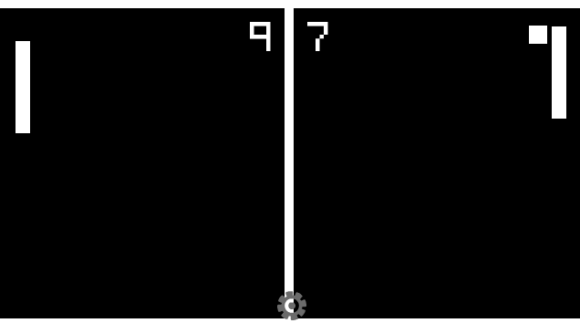

# 20 Games Challenge #1: Pong (Godot 4)

This project is the first installment of the **"20 Games Challenge"**, aimed at mastering game development fundamentals. I have rebuilt the classic Pong with modern mechanics, a smooth AI, and mobile-ready controls.

## Key Features

- **Dynamic Ball Physics:** The ball bounces at different angles based on where it hits the paddle (Angle Manipulation), allowing players to "aim" their shots strategically.
- **Increasing Difficulty:** The ball's speed increases permanently with each paddle hit, creating a challenging and high-tension gameplay loop.
- **Smart AI Opponent:** A smooth, jitter-free AI built using `move_toward` and `lerp`. It has a speed cap to ensure it's challenging yet beatable.
- **Pause Menu:** A fully functional pause system with Resume and Quit options.
- **Sound Effects:** Dedicated audio feedback for paddle hits and scoring moments.
- **Mobile & Touch Support:** Split-screen touch controls. The left half of the screen controls the left paddle, and the right half controls the right paddle for local 2-player matches.
- **Polished Game Loop:** Automatic respawning after goals, with the ball serving toward the winner of the last point.

## Controls

- **Player 1 (Left):** `W` (Up) / `S` (Down) or **Touch** (Left side of screen)
- **Player 2 (Right/AI):** `Up Arrow` / `Down Arrow` or **Touch** (Right side of screen)

## Technical Breakdown

- **Engine:** Godot 4.5
- **Language:** GDScript
- **Techniques Implemented:**
  - Precise collision detection using `move_and_collide`.
  - Vector mathematics for direction and angle manipulation.
  - Signal-based architecture for UI and Audio management.
  - `_physics_process` optimization for consistent 60FPS movement.

## Installation (Android)

You can download the playable Android version of the game from the link below:
1. Go to the [Releases](https://github.com/thelastbucuc/20-Games-Challenge-1-Pong/releases) page.
2. Download the `pong.apk` file.
3. Enable "Install from Unknown Sources" on your Android device.
4. Install and enjoy in **Landscape** mode!

## Learning Outcomes
Through this project, I have mastered:
- [x] Clean scene hierarchy and script architecture.
- [x] Version control (Git) workflow.
- [x] UI/UX design (Scoreboards and Pause Menus).
- [x] Optimization for mobile platforms.

## Assets & Credits

This project uses a mix of custom-made assets and high-quality community resources:

- **Art & UI:** - Custom paddle and ball sprites created by me.
  - UI Elements and Icons: [Kenney.nl](https://kenney.nl/) (Asset Packs).
- **Audio:** - Sound effects sourced from [Kenney.nl](https://kenney.nl/) Audio packs.
- **Fonts:** - Retro/Gaming fonts sourced from [Kenney.nl](https://kenney.nl/).

*Special thanks to Kenney for providing amazing open-source resources for game developers.*

---
*This project marks the beginning of my professional game development journey.*
